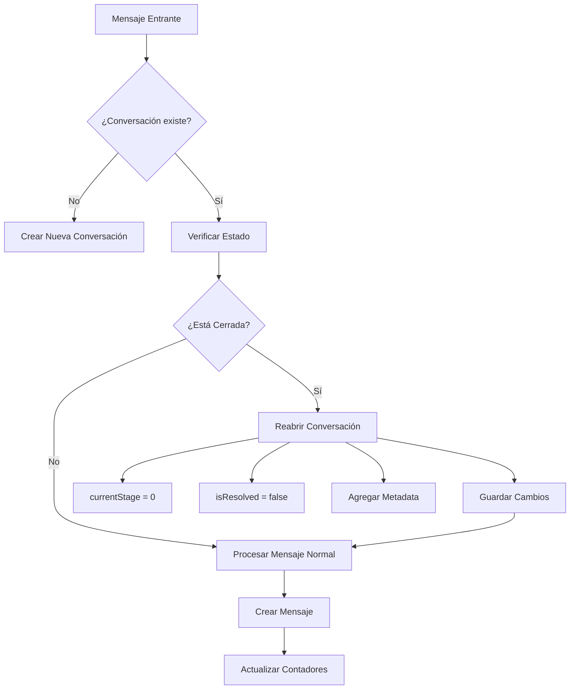

# Corrección: Reapertura Automática de Conversaciones

## Problema Identificado

El sistema de kanban de conversaciones tenía un problema crítico donde las conversaciones cerradas no se reabrían correctamente cuando los clientes enviaban nuevos mensajes, causando que los asesores no vieran estas conversaciones en la interfaz.

### Problemas Específicos:

1. **❌ Condición muy restrictiva**: Solo reabrían conversaciones después de 24 horas
2. **❌ Stage hardcodeado**: Solo funcionaba con stage 3 como "Finalizado"
3. **❌ Falta de lógica en API**: El endpoint `addMessage` no tenía lógica de reapertura
4. **❌ No dinámico**: No se adaptaba a diferentes pipelines de organizaciones

## Solución Implementada

### 1. Nueva Función Utilitaria: `reopenConversationIfClosed`

**Ubicación**: `/src/services/conversations/createConversation.ts`

```typescript
export const reopenConversationIfClosed = async (conversation: any): Promise<boolean>
```

**Características**:

- ✅ **Dinámico**: Busca automáticamente el stage de "Cerrado" en el pipeline
- ✅ **Flexible**: Reconoce múltiples nombres: "cerrado", "finalizado", "resuelto", "completado"
- ✅ **Fallback**: Si no encuentra stage específico, usa el último del pipeline
- ✅ **Inmediato**: Reabre sin restricciones de tiempo
- ✅ **Auditable**: Agrega metadata con timestamp de reapertura

### 2. Webhook Actualizado

**Archivo**: `/src/controllers/chat/services/handleWebHook.ts`

**Cambios**:

- ❌ Removida lógica antigua de 24 horas
- ✅ Implementada nueva función de reapertura
- ✅ Actualización automática de `lastMessage` y `unreadCount`

### 3. API addMessage Mejorada

**Archivo**: `/src/controllers/conversation/addMessage.ts`

**Cambios**:

- ✅ Verificación de reapertura para mensajes entrantes
- ✅ Respuesta incluye estado actualizado de la conversación
- ✅ Logging para auditoría

## Flujo de Reapertura



## Estados de Conversación

| Estado             | currentStage | isResolved | Acción         |
| ------------------ | ------------ | ---------- | -------------- |
| Sin Atender        | 0            | false      | ✅ No cambiar  |
| En Proceso         | 1            | false      | ✅ No cambiar  |
| Esperando Cliente  | 2            | false      | ✅ No cambiar  |
| Cerrado/Finalizado | 3+           | true       | 🔄 **REABRIR** |

## Casos de Uso Solucionados

### ✅ Caso 1: Cliente escribe inmediatamente después de cerrar

- **Antes**: Conversación permanecía cerrada
- **Ahora**: Se reabre automáticamente a "Sin Atender"

### ✅ Caso 2: Diferentes pipelines por organización

- **Antes**: Solo funcionaba con stage 3
- **Ahora**: Detecta dinámicamente el stage de cierre

### ✅ Caso 3: Mensajes via API

- **Antes**: No se reabrían conversaciones
- **Ahora**: Funciona tanto en webhook como en API

### ✅ Caso 4: Auditoría y trazabilidad

- **Antes**: Sin registro de reaperturas
- **Ahora**: Metadata con timestamp de cada reapertura

## Pruebas Recomendadas

1. **Prueba Básica**:

   - Cerrar una conversación manualmente
   - Enviar mensaje desde WhatsApp
   - Verificar que aparece en "Sin Atender"

2. **Prueba de Pipeline**:

   - Crear pipeline con stage "Finalizado"
   - Repetir prueba básica
   - Verificar funcionamiento

3. **Prueba de API**:
   - Usar endpoint `POST /conversations/:id/messages`
   - Con `direction: "incoming"`
   - Verificar reapertura

## Monitoreo

Los logs incluyen:

```
Conversación {id} reabierta automáticamente
Conversación {id} fue reabierta automáticamente por mensaje entrante
```

## Archivos Modificados

1. `/src/services/conversations/createConversation.ts` - Nueva función
2. `/src/controllers/chat/services/handleWebHook.ts` - Lógica webhook
3. `/src/controllers/conversation/addMessage.ts` - API de mensajes
4. `/src/services/conversations/reopenConversation.test.ts` - Documentación de pruebas

## Compatibilidad

- ✅ Compatible con pipelines existentes
- ✅ No afecta conversaciones activas
- ✅ Mantiene estructura de datos existente
- ✅ Funciona con múltiples organizaciones
